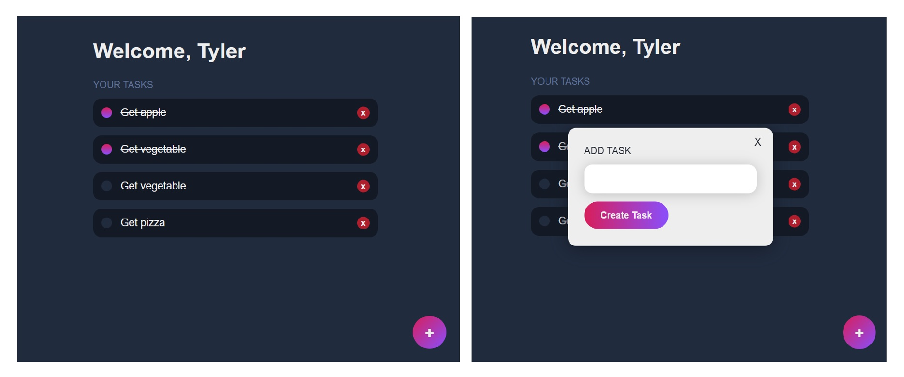
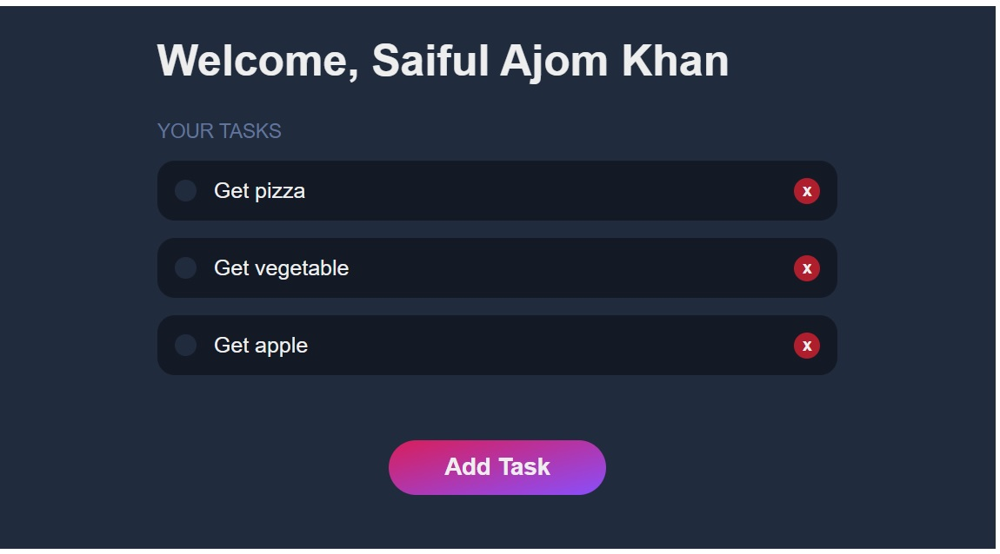

# Products List App with React-Redux & Redux-Toolkit
<!-- ### It's a Full Mobile Responsive App -->

### Go to Live Project: https://mern-stock-todos-app.netlify.app/
<!--  -->
<!--  -->

### Mearn Full Stack Simple App
* React
* Node.js
* Express.js
* MongoDB
* Mongoose

##### It’s may be very simple but It is very important and fundamental to integrating Frontend and Backend.
##### I am intermediate level in Frontend but Backend was trying hard.
##### Now, I am very happy to learn backend easily with Node.js & MongoDB.
